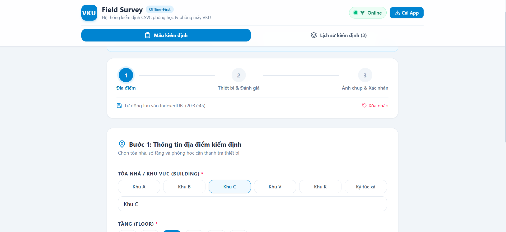
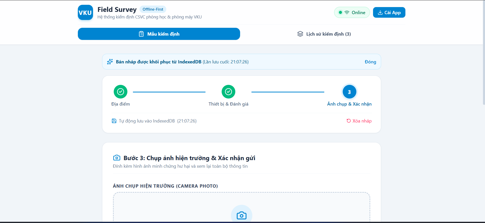
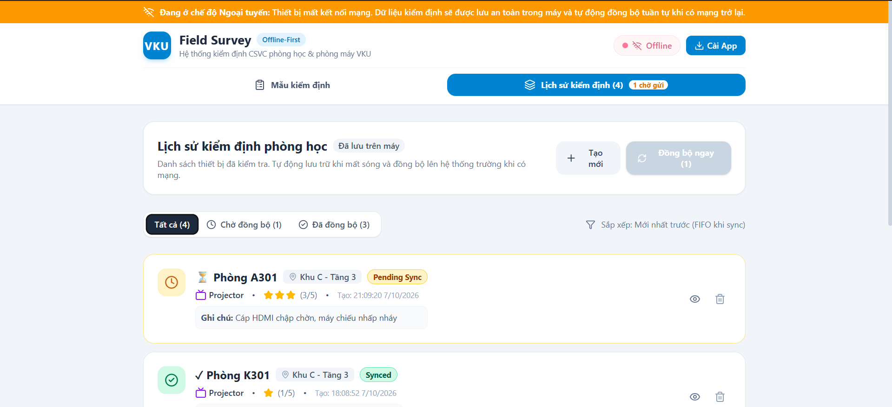

# MINI-PROJECT SHORT TECHNICAL REPORT
**Course:** Cross-Platform Mobile App Development (VKU) / Lập Trình Đa Nền Tảng  
**Mini-Project Title:** Mini-Project 1: VKU Field Survey — Offline Data Collection (PWA)  
**Class / Lớp:** 23IT.B249  
**Team / Student Name:** Lê Hoàng Vũ
**Submission Date:** 25/9/2026

---

## 1. GENERAL INFORMATION & DELIVERABLE LINKS
* **Team Members:**
  1. Lê Hoàng Vũ — Student ID: 23IT.B249 — Role: Full-stack Developer / Architecture & Logic — Contribution: 100%
* **🔗 Live Demo URL:** https://vku-field-survey.vule0709.workers.dev/
* **💻 GitHub Repository:** [Dán link GitHub repo vào đây, ví dụ: https://github.com/vule0309/vku-field-survey

---

## 2. FEATURE IMPLEMENTATION CHECKLIST

| # | Required Feature | Status | Implementation Details & Acceptance Level |
|:---:|---|:---:|---|
| **1** | **PWA Standalone Installation** | ✅ Complete | Cấu hình `manifest.json` chuẩn (`display: standalone`, `theme_color: #0284c7`, responsive icons 192x192 & 512x512). Bắt sự kiện `beforeinstallprompt` với nút **"Cài App"** trực tiếp trên Header. |
| **2** | **App Shell & Cache-First Strategy** | ✅ Complete | Tệp `sw.js` lưu trữ App Shell (HTML, CSS, JS, icons) vào Cache Storage. Khi mở app, Service Worker ưu tiên đọc từ Cache trước (khởi động tức thì < 1s, hoạt động 100% khi mất mạng hoàn toàn). |
| **3** | **Multi-step Inspection Form** | ✅ Complete | Form 3 bước hoàn chỉnh: <br>• **Bước 1:** Tòa nhà (Khu A, B, C, V, K, KTX), Tầng (1–6), Phòng học.<br>• **Bước 2:** Danh mục (Hardware, Projector, AC, Electrical, Furniture), Đánh giá 1–5 ⭐, Ghi chú hư hỏng.<br>• **Bước 3:** Chụp ảnh hiện trường, Thẻ xem lại (Review Card) và nút Xác nhận. |
| **4** | **Real-time Local Draft Persistence** | ✅ Complete | Sử dụng thư viện `idb` lưu bản nháp vào store `draft` của IndexedDB trên từng thao tác nhập (debounced 300ms). F5, đóng tab hoặc tắt trình duyệt mở lại dữ liệu khôi phục nguyên vẹn 100%. |
| **5** | **Offline Submission Queue** | ✅ Complete | Khi gửi không có mạng, bản ghi được cấp **UUID** (`crypto.randomUUID()`), nhãn thời gian ISO timestamp và lưu vào IndexedDB với trạng thái **`PENDING_SYNC`** (⏳ Chờ gửi). |
| **6** | **Automatic Sequential Sync** | ✅ Complete | Lắng nghe sự kiện `window.ononline` và Background Sync API (`sync-surveys`). Khi có mạng trở lại, hệ thống tự động đồng bộ **tuần tự (Sequential FIFO)** từng khảo sát một kèm thanh tiến trình và chuyển sang `SYNCED` (✓ Đã gửi). |
| **7** | **Camera Evidence & Compression** | ✅ Complete | Tích hợp chụp ảnh hiện trường qua `<input capture="environment">`. Tự động nén ảnh qua HTML5 Canvas (max 1024px, quality 0.75) giúp tối ưu dung lượng IndexedDB và giảm độ trễ khi đồng bộ. |

---

## 3. TECHNICAL ARCHITECTURE & PROJECT STRUCTURE

### 3.1. Directory Structure
```text
Project 1/
├── public/
│   ├── manifest.json         # PWA Manifest: standalone, theme_color #0284c7, icons
│   ├── sw.js                 # Service Worker: Cache-First, Background Sync, Mock API
│   └── icons/
│       ├── icon-192.png      # Biểu tượng 192x192
│       └── icon-512.png      # Biểu tượng 512x512
├── src/
│   ├── components/
│   │   ├── Header.tsx        # Thanh điều hướng 2 tab, trạng thái Online/Offline, nút Cài App
│   │   ├── SurveyForm.tsx    # Multi-step Form (3 bước), tự lưu nháp IndexedDB, camera nén ảnh
│   │   └── SurveyQueue.tsx   # Lịch sử kiểm định (Hiển thị ✓ Đã gửi / ⏳ Chờ gửi, thanh tiến trình)
│   ├── services/
│   │   ├── db.ts             # Thao tác IndexedDB bằng 'idb' (Stores: draft, surveys, server_logs)
│   │   ├── sync.ts           # Xử lý đồng bộ tuần tự (Sequential FIFO) & background sync
│   │   └── sw-register.ts    # Đăng ký Service Worker, bắt online/offline, beforeinstallprompt
│   ├── types/
│   │   └── survey.ts         # TypeScript models (SurveyDraft, SurveyRecord, Category, Status)
│   ├── utils/
│   │   └── image.ts          # Nén ảnh hiện trường qua HTML5 Canvas sang Base64
│   ├── App.tsx               # Root component điều phối luồng dữ liệu & trạng thái mạng
│   ├── main.tsx              # React DOM entry point
│   └── index.css             # Tailwind CSS & theme styling
├── scripts/
│   └── generate-icons.js     # Script tạo bộ icon PWA tự động bằng Node.js zlib
├── package.json
└── vite.config.ts
```

### 3.2. Data Flow Architecture
```text
                [ Người dùng thao tác ]
                           │
       ┌───────────────────┴───────────────────┐
       ▼                                       ▼
[ Nhập Form kiểm định ]               [ Gửi khảo sát ]
       │                                       │
       ▼                                       ▼
Auto-save IndexedDB                Cấp UUID + Timestamp
(Store: 'draft')                  Trạng thái: PENDING_SYNC
(F5 không mất dữ liệu)                         │
                                               ▼
                                      Lưu vào IndexedDB
                                      (Store: 'surveys')
                                               │
                                 ┌─────────────┴─────────────┐
                                 ▼                           ▼
                           [ MẤT MẠNG ]                 [ CÓ MẠNG ]
                                 │                           │
                          Giữ PENDING_SYNC            Auto Sequential Sync
                          (Hiện icon ⏳)              (Survey 1 -> Survey 2 -> ...)
                                 │                           │
                                 └────► [ Có mạng lại ] ─────┘
                                               │
                                               ▼
                                         Server HTTP 201
                                       Chuyển thành SYNCED
                                         (Hiện icon ✓)
```

---

## 4. EMPIRICAL EVIDENCE & SCREENSHOTS

*(Chụp 3–4 ảnh màn hình ứng dụng đang chạy thực tế trên thiết bị/trình duyệt và dán vào các mục dưới đây)*

### 4.1. Mẫu kiểm định Multi-step & Chụp ảnh hiện trường
*Hình ảnh form nhập liệu Bước 1 (Tòa nhà, Phòng), Bước 2 (Danh mục, Đánh giá ⭐) và Bước 3 (Chụp ảnh thiết bị hư hỏng):*



### 4.2. Khả năng chống mất dữ liệu (IndexedDB Draft Persistence)
*Hình ảnh minh chứng dữ liệu vẫn còn nguyên vẹn sau khi người dùng F5 hoặc tắt trình duyệt mở lại:*



### 4.3. Hàng đợi Ngoại tuyến (Offline Queue) & Đồng bộ tuần tự (Sequential Sync)
*Hình ảnh danh sách phòng với trạng thái `⏳ Chờ gửi` khi mất mạng, và thanh tiến trình tự động đồng bộ tuần tự chuyển sang `✓ Đã gửi` khi có mạng trở lại:*



---

## 5. TECHNICAL CHALLENGES & RESOLUTIONS

* **Thách thức 1: Giới hạn dung lượng lưu trữ ảnh trong IndexedDB và độ trễ đồng bộ mạng**
  * *Vấn đề:* Ảnh chụp gốc từ camera điện thoại thường có dung lượng từ 3MB – 8MB. Nếu lưu nhiều ảnh gốc trực tiếp vào IndexedDB sẽ nhanh chóng làm chậm trình duyệt và khiến quá trình gửi dữ liệu qua mạng di động yếu bị timeout.
  * *Giải pháp:* Xây dựng module tiện ích  sử dụng HTML5 Canvas để tự động nén kích thước tối đa xuống `1024px` và chất lượng `0.75`. Dung lượng mỗi ảnh giảm xuống còn ~80KB – 150KB mà vẫn đảm bảo độ nét rõ ràng của thiết bị kiểm định, giúp lưu trữ nhẹ nhàng và đồng bộ tức thì.

* **Thách thức 2: Đồng bộ tuần tự (Sequential FIFO) tránh nghẽn mạng và xung đột dữ liệu**
  * *Vấn đề:* Khi có mạng trở lại sau thời gian dài mất kết nối, nếu gửi đồng thời (Parallel `Promise.all`) tất cả 20–30 khảo sát cùng lúc có thể gây nghẽn kết nối mạng yếu và khó theo dõi tiến độ từng phòng.
  * *Giải pháp:* Thiết kế hàng đợi đồng bộ tuần tự FIFO trong [`sync.ts`] bằng vòng lặp `for...of` với `async/await`. Mỗi bản ghi được dispatch tuần tự (`Survey 1 -> Server -> SYNCED`, rồi mới tiếp tục `Survey 2`). Giao diện đồng thời cập nhật thanh phần trăm tiến trình thời gian thực và tự động dừng an toàn nếu mạng chập chờn bị ngắt giữa chừng.

* **Thách thức 3: Tránh xung đột ghi đè dữ liệu khi tự lưu bản nháp liên tục**
  * *Vấn đề:* Người dùng gõ phím nhanh trên ô Ghi chú lỗi có thể gây ra hàng chục lệnh ghi I/O liên tiếp vào IndexedDB, dẫn đến hiện tượng nghẽn luồng xử lý của trình duyệt.
  * *Giải pháp:* Áp dụng kỹ thuật Debounce `300ms` trong `useEffect` của . Dữ liệu chỉ ghi xuống IndexedDB khi người dùng tạm ngừng gõ, vừa đảm bảo dữ liệu luôn được lưu mới nhất vừa giữ hiệu năng mượt mà.

---

## 🛠️ HƯỚNG DẪN CÀI ĐẶT & CHẠY DỰ ÁN (SETUP GUIDE)

### 1. Yêu cầu môi trường
* Node.js: Phiên bản **18.x** trở lên (Khuyên dùng Node 20.x hoặc mới hơn).
* Trình duyệt: Google Chrome, Microsoft Edge, Safari hoặc Firefox có hỗ trợ Service Worker.

### 2. Cài đặt các thư viện phụ thuộc
Mở terminal trong thư mục `Project 1` và chạy:
```bash
npm install
```

### 3. Chạy ở chế độ Phát triển (Development)
```bash
npm run dev
```
Mở trình duyệt truy cập: `http://localhost:5173`

### 4. Build sản phẩm & Chạy thử nghiệm PWA hoàn chỉnh
```bash
npm run build
npm run preview
```
Mở trình duyệt truy cập: `http://localhost:4173`

---
